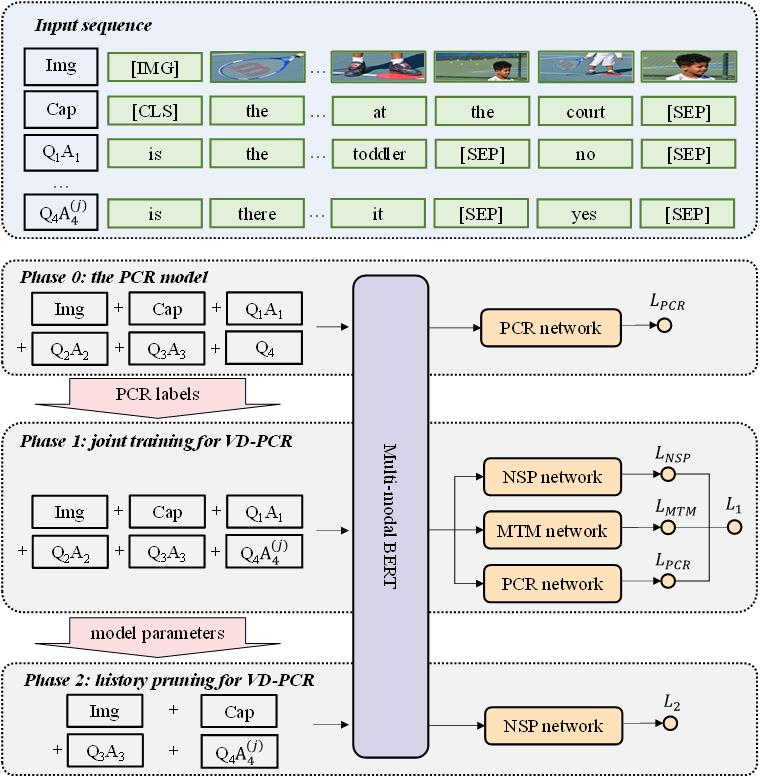

# VD-PCR #

PyTorch implementation for the paper:

**[VD-PCR: Improving visual dialog with pronoun coreference resolution](https://doi.org/10.1016/j.patcog.2022.108540)**  
Xintong Yu, Hongming Zhang, Ruixin Hong, Yangqiu Song, Changshui Zhang 

The visual dialog task requires an AI agent to interact with humans in multi-round dialogs based on a visual environment. As a common linguistic phenomenon, pronouns are often used in dialogs to improve the communication efficiency. As a result, resolving pronouns (i.e., grounding pronouns to the noun phrases they refer to) is an essential step towards understanding dialogs. In this paper, we propose VD-PCR, a novel framework to improve Visual Dialog understanding with Pronoun Coreference Resolution in both implicit and explicit ways. First, to implicitly help models understand pronouns, we design novel methods to perform the joint training of the pronoun coreference resolution and visual dialog tasks. Second, after observing that the coreference relationship of pronouns and their referents indicates the relevance between dialog rounds, we propose to explicitly prune the irrelevant history rounds in visual dialog models' input. With pruned input, the models can focus on relevant dialog history and ignore the distraction in the irrelevant one. With the proposed implicit and explicit methods, VD-PCR achieves state-of-the-art experimental results on the VisDial dataset.

<div align=center>

</div>

The readers are welcome to star/fork this repository and use it to train your own model, reproduce our experiment, and follow our future work. Please kindly cite our paper:

```
@article{DBLP:journals/pr/YuZHSZ22,
  author    = {Xintong Yu and
               Hongming Zhang and
               Ruixin Hong and
               Yangqiu Song and
               Changshui Zhang},
  title     = {{VD-PCR:} Improving visual dialog with pronoun coreference resolution},
  journal   = {Pattern Recognit.},
  volume    = {125},
  pages     = {108540},
  year      = {2022},
  url       = {https://doi.org/10.1016/j.patcog.2022.108540},
  doi       = {10.1016/j.patcog.2022.108540},
  biburl    = {https://dblp.org/rec/journals/pr/YuZHSZ22.bib},
  bibsource = {dblp computer science bibliography, https://dblp.org}
}
```


## Table of Contents

   * [Setup and Dependencies](#setup-and-dependencies)
   * [Usage](#usage)
      * [Download preprocessed data](#download-preprocessed-data)
      * [Download pre-trained checkpoints](#download-pre-trained-checkpoints)
      * [Direct Inference](#direct-inference)
      * [Training](#training)
      * [Logging](#logging)

## Setup and Dependencies

Our code is implemented in PyTorch (v1.7). To setup, do the following:

1. Install Python 3.7+
2. Get the source:
```
git clone https://github.com/HKUST-KnowComp/VD-PCR VD-PCR
```
3. Install requirements into the `vd-pcr` virtual environment, using [Anaconda](https://anaconda.org/anaconda/python):
```
conda env create -f environment.yml
```
4. Install [apex](https://github.com/NVIDIA/apex) (optional for acceleration in Phase 1).

## Usage

The basic usage is to run `main.py` with `--model [MODEL_TYPE]/[MODEL_NAME] --mode [MODE]`, where `[MODEL_TYPE]` is one of `(conly, vonly, joint)`, `[MODEL_NAME]` is defined in corresponding `config/[MODEL_TYPE].conf`, and `[MODE]` is one of `(train, eval, predict, debug)`.

Use `GPU` as the environment variable `CUDA_VISIBLE_DEVICES`.

Experiment setups are stored in `config/*.conf`. The explaination of hyperparameters are in [config](https://github.com/HKUST-KnowComp/VD-PCR/tree/master/config).

All the hyperparameters and estimated time are conducted on 7 GeForce RTX 2080 Ti with NVIDIA-SMI 430.64 and CUDA 10.1. If the code is conducted on different GPU settings, you can try changing `batch_size`, `sequences_per_image`, `eval_batch_size`, and `eval_line_batch_size` in configs.


-----------------------------------
### Download preprocessed data

Download preprocessed [VisDial dataset with VisPro annotations](https://drive.google.com/drive/folders/1w5L_i8h9h32dCCZpOJDsur4TIYLOtS8F?usp=sharing) and put them under `data/all` folder.

Preprocess data to fit ViLBERT and VisPro format. Correct dense annotation by setting gt answer score to 1 following [Agarwal et al.](https://aclanthology.org/2020.acl-main.728/):
```
python preprocessing/pre_process_visdial.py
python preprocessing/get_vispro_only.py --processed
python preprocessing/correct_dense.py
```

Download the extracted features of ViLBERT:

```
mkdir -p data/visdial/visdial_img_feat.lmdb
wget https://s3.amazonaws.com/visdial-bert/data/visdial_image_feats.lmdb/data.mdb -O data/visdial/visdial_img_feat.lmdb/data.mdb
wget https://s3.amazonaws.com/visdial-bert/data/visdial_image_feats.lmdb/lock.mdb -O data/visdial/visdial_img_feat.lmdb/lock.mdb
```

-----------------------------------
### Download pre-trained checkpoints

Download the corresponding checkpoints if you need to apply inference or training of the model.

+ For direct inference of Phase 1 model and direct training of Phase 2 model: download the checkpoint [epoch_best.ckpt](https://drive.google.com/drive/folders/1xe1hN9leSmInkjTZjs6KDiWqllQTBl02?usp=sharing) and put it under the folder `logs/joint/MB-JC`.

+ For direct inference of Phase 2 model: download the checkpoint [epoch_2.ckpt](https://drive.google.com/drive/folders/1n_6atdQc98OrapdY6PH9x55FpQP7twfv?usp=sharing) and put it under the folder `logs/vonly/MB-JC-HP-crf_cap-trainval`.

+ For training of Phase 0 and Phase 1 model: download pre-trained checkpoints of ViLBERT.
```
mkdir checkpoints-release
wget https://s3.amazonaws.com/visdial-bert/checkpoints/bestmodel_no_dense_finetuning -O checkpoints-release/basemodel
```

-----------------------------------
### Direct Inference

#### Phase 1: Joint training for VD-PCR

Evaluating on VisDial val set with the MB-JC model
+ Run command
```
GPU=0,1,2,3,4,5,6 python main.py --model joint/MB-JC --mode eval
```
The expected output is:
```
r@1: 0.5691261887550354
r@5: 0.8593204021453857
r@10: 0.93708735704422
mean: 3.1439805030822754
mrr: 0.6984539031982422
ndcg: 0.4472862184047699
```

Inferencing on VisDial test set with the MB-JC model
```
GPU=0,1,2,3,4,5,6 python main.py --model vonly/MB-JC_predict --mode predict
python postprocessing/merge_predictions.py --mode phase1 --model MB-JC_predict
```
The prediction file can be submitted to [VisDial test server](https://eval.ai/challenge/518/overview).

Evaluating on VisPro test set with the MB-JC model
```
GPU=0 python main.py --model conly/MB-JC_eval --mode eval
```
The expected output is:
```
Pronoun_Coref_average_precision:        0.9217
Pronoun_Coref_average_recall:   0.8376
Pronoun_Coref_average_f1:       0.8776
```

#### Phase 2: History pruning for VD-PCR

Inferencing on VisDial test set with the MB-JC-HP model

+ Run command
```
GPU=0,1,2,3,4,5,6 python main.py --model vonly/MB-JC-HP-crf_cap-test --mode predict
python ensemble.py --exp convert --mode predict
```
The prediction file can be submitted to [VisDial test server](https://eval.ai/challenge/518/overview).

-----------------------------------
### Training

For any phase, you can set `--mode debug` to debug the code.

During training, checkpoints are saved after each epoch finishes. 
If training aborts, just use the original command to resume training from the last saved checkpoints.


#### Phase 0: PCR model on VisDial

We merge the coreference prediction of PCR models into the preprocessed VisDial data. You can also train the MB+pseudo model from scratch with
```
GPU=0 python main.py --model conly/MB-pseudo --mode train
```

Evaluate the model with 
```
GPU=0 python main.py --model conly/MB-pseudo --mode eval
```

#### Phase 1: Joint training for VD-PCR

Select the coreference-related heads from the base model with
```
GPU=0 python postprocessing/find_coref_head.py
```

Train the MB-JC model
```
GPU=0,1,2,3,4,5,6 python main.py --model joint/MB-JC --mode train
```
The training takes 33h.

Evaluate the MB-JC model
```
GPU=0,1,2,3,4,5,6 python main.py --model joint/MB-JC --mode eval
```

Inferencing on VisDial test set with the MB-JC model
```
GPU=0,1,2,3,4,5,6 python main.py --model vonly/MB-JC_predict --mode predict
python postprocessing/merge_predictions.py --mode phase1 --model MB-JC_predict
```
The prediction file can be submitted to [VisDial test server](https://eval.ai/challenge/518/overview).

Evaluating on VisPro test set with the MB-JC model
```
GPU=0 python main.py --model conly/MB-JC_eval --mode eval
```

#### Phase 2: History pruning for VD-PCR

Prune history inputs with various rules:
```
python preprocessing/extract_relevant_history.py --include_cap --save_name crf_cap
python preprocessing/extract_relevant_history.py --save_name crf
python preprocessing/extract_relevant_history.py --include_cap --q_only --save_name cap
```

Train the MB-JC-HP model with different pruning rules by setting `[RULE]` to be one of `(crf_cap, crf, cap, all)`:
```
GPU=0,1,2,3,4,5,6 python main.py --model vonly/MB-JC-HP-[RULE] --mode train
```
The training takes 1.5h.

Evaluate the MB-JC-HP model:
```
GPU=0,1,2,3,4,5,6 python main.py --model vonly/MB-JC-HP-[RULE] --mode eval
```

Ensemble models of various rules:
```
python postprocessing/merge_predictions.py --mode phase2 --model MB-JC-HP-[RULE] --split val
python ensemble.py --exp val --mode eval
```

For final inference on test set, use both train and val sets as training data to train the MB-JC-HP model:
```
GPU=0,1,2,3,4,5,6 python main.py --model vonly/MB-JC-HP-[RULE]-trainval --mode train
```
The training takes 3.5h.

Inferencing on VisDial test set with the MB-JC-HP model
```
GPU=0,1,2,3,4,5,6 python main.py --model vonly/MB-JC-HP-[RULE]-test --mode predict
```

Ensemble predictions of various rules:
```
python ensemble.py --exp test --mode predict
```
The prediction file can be submitted to [VisDial test server](https://eval.ai/challenge/518/overview).


-----------------------------------
### Logging

All logs are under `logs` folder. We use tensorboard to visualize the results:
```
tensorboard --logdir=./logs
```


## Acknowledgements

Builds on vmurahari3's [visdial-bert](https://github.com/vmurahari3/visdial-bert) and YangXuanyue's [pytorch-e2e-coref](https://github.com/YangXuanyue/pytorch-e2e-coref).

## Others

If you have questions about the data or the code, you are welcome to open an issue or send me an email, I will respond to that as soon as possible.